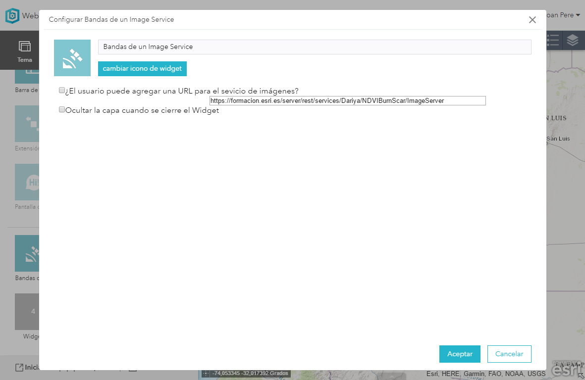

# ImageServiceBand- WebAppWidget
The ImageServiceBand is a widget where you can add an ImageService and using the widget it's posible to modify the band combination of the Widget.

Developed for Web AppBuilder
##About
###Initial config
* You can set to allow the user to load their own Image Services or specify an URL for the Image Service.
  * 
  
 ###Widget
* Once we have our widget config ready and the Image Service Loaded we will see the selectors for the band combination.
  * 
  
 ###Installation
 To see the widget once we open any of our App we need to follow the next steps:

* It works with Bootrstap so we have to replace the index.html and the init.js files from our web app (or add the code lines that you can find below comments like //Bootstrap).

* Copy the ImageServiceBand folder inside the stemapp/widgets directory
